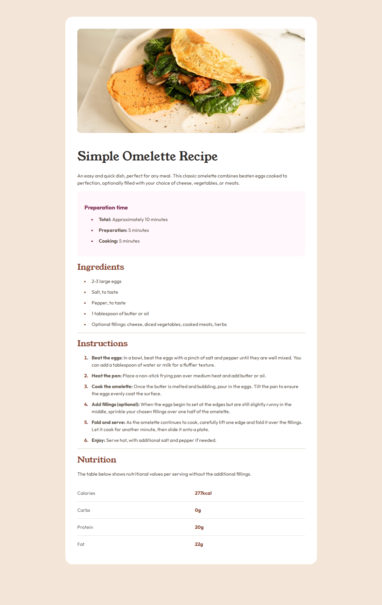

# Frontend Mentor - Recipe page solution

This is a solution to the [Recipe page challenge on Frontend Mentor](https://www.frontendmentor.io/challenges/recipe-page-KiTsR8QQKm). Frontend Mentor challenges help you improve your coding skills by building realistic projects.

## Table of contents

- [Overview](#overview)
  - [The challenge](#the-challenge)
  - [Screenshot](#screenshot)
  - [Links](#links)
- [My process](#my-process)
  - [Built with](#built-with)
  - [What I learned](#what-i-learned)
  - [Continued development](#continued-development)
  - [Useful resources](#useful-resources)
- [Author](#author)
- [Acknowledgments](#acknowledgments)

## Overview

### The challenge

Users should be able to:

- View the optimal layout for the page depending on their device's screen size
- See hover states for all interactive elements on the page

### Screenshot



### Links

- Solution URL: [Add solution URL here](https://your-solution-url.com)
- Live Site URL: [Add live site URL here](https://your-live-site-url.com)

## My process

### Built with

- Semantic HTML5 markup
- CSS custom properties
- Flexbox
- Mobile-first workflow

### What I learned

This project was a great opportunity to practice semantic HTML and responsive design using CSS Flexbox.

I used the `<table>` element for the nutrition section to properly structure the tabular data.

```html
<table class="nutrition-table">
  <tr>
    <td class="label">Calories</td>
    <td class="value font-4-bold">277kcal</td>
  </tr>
</table>
```

I also used CSS variables (custom properties) to manage colors and spacing consistently throughout the project.

```css
:root {
    --color-rose-800: #7a284e;
    --color-rose-50: #fff7fb;
    --color-stone-900: #312e2c;
    /* ... */
}
```

### Continued development

In future projects, I would like to explore CSS Grid for more complex layouts and further improve accessibility features.

### Useful resources

- [MDN Web Docs](https://developer.mozilla.org/en-US/) - This is my go-to resource for HTML and CSS documentation.

## Author

- Website - [Your Name](https://www.your-site.com)
- Frontend Mentor - [@yourusername](https://www.frontendmentor.io/profile/yourusername)
- Twitter - [@yourusername](https://www.twitter.com/yourusername)

## Acknowledgments

Thanks to Frontend Mentor for providing this challenge.
